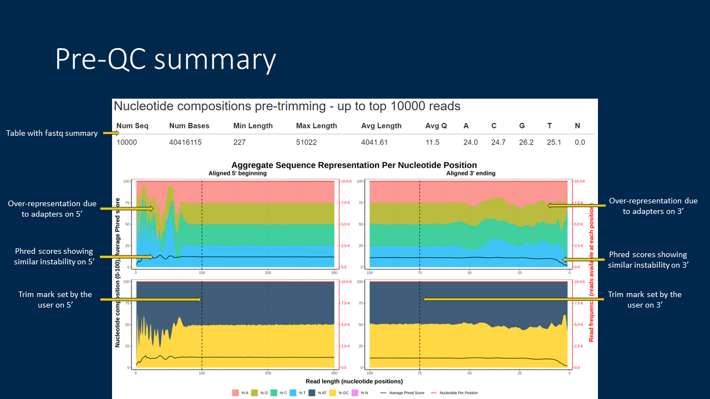
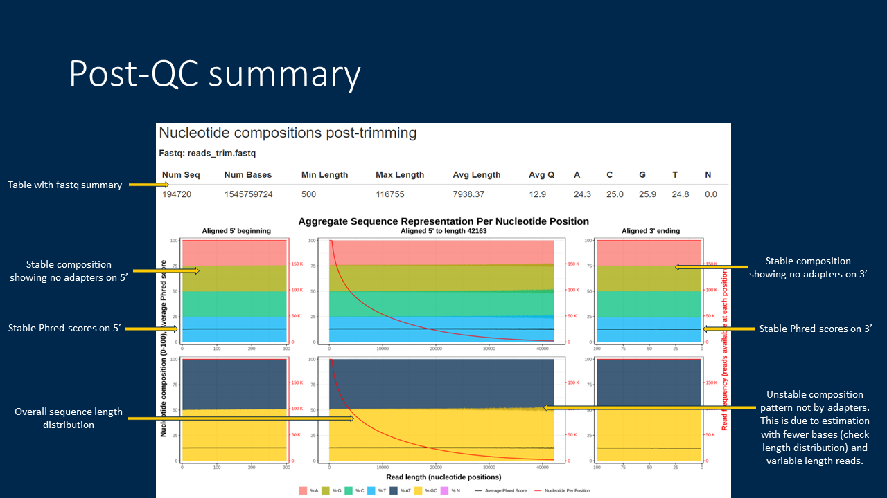
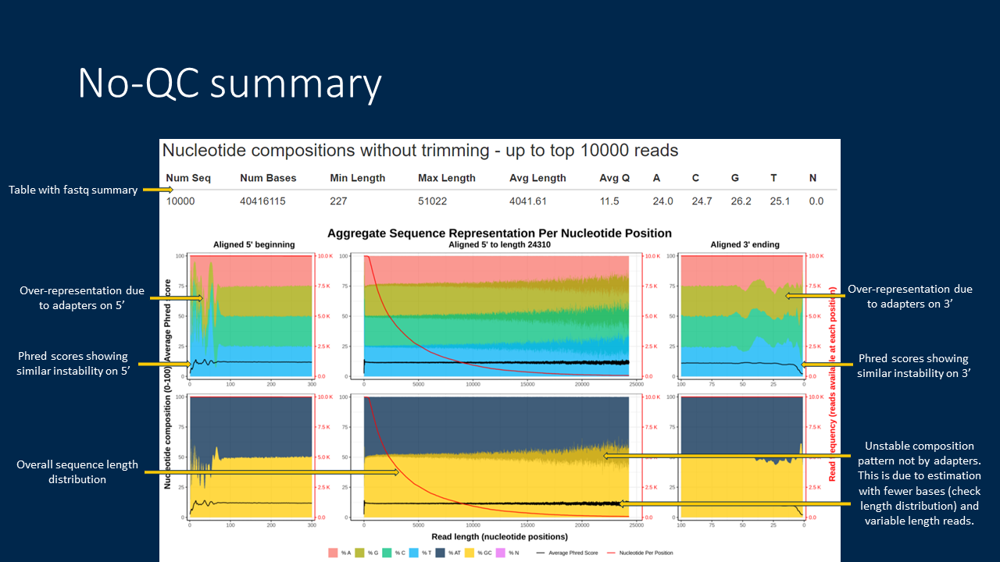

# SNIKT

---

**Snikt** (**Slice Nucleotides Into Klassifiable Tequences**) is a wrapper program written in R that reports a visual confirmation of adapter or systemic contamination in metagenomic sequencing DNA or RNA reads and trims sequence ends to remove them. This program depends on [Seqtk](https://github.com/lh3/seqtk) for handling of fastq data, which is a fast, lightweight tool written in C.  

This program is most suitable for long, variable-length reads, for example, from the Oxford Nanopore instruments. This is because read end trimming for long reads does not have a significant impact on the overall read throughput post-cleaning. This program has also been modified to accomodate short, fixed-length (Illumina) reads for identification of adapter contamination, however, end-trimming on such datasets is disabled by default.

## 1. Installation

SNIKT is only available on Unix-like platforms (Linux, Mac OS and WSL). The easiest way to use SNIKT, in our opinion, is to use the Conda package management for set up. However, being a wrapper written in R, this program can also be used with a local R installation given it has access to `seqtk` and some R libraries. Both of these setup options are explained below.

### 1.1 Installation via Bioconda

For this setup process to work, you will need to install the Conda package manager and setup Bioconda repositories. Instructions for setting up Bioconda can be found on the [Bioconda installation page](https://bioconda.github.io/user/install.html). Only setup steps 1 and 2 are needed for this. Once you have the `conda` set up and working, please start a new session.

*Optional: Install and use mamba for conda management.*
[Mamba](https://github.com/mamba-org/mamba) is a reimplementation of the Conda package manager in C++ and has several benefits over using Conda. It works as a drop-in replacement for `conda` for most Conda commands except for environment activation commands. Full help and instructions can be viewed on the [Mamba GitHub page](https://github.com/mamba-org/mamba), but for simplicity here is how you can install `mamba` with your bioconda installation.
```
$ conda install -n base -c conda-forge mamba
```
After this installation, mamba can be used in the next step (and for management of any other environments/packages).

We are considering making this software available as a conda recipe in the future which will simplify the installation to almost a single command. Until then, please follow these steps to set up SNIKT via `conda`.

Set up a new environment and install dependencies. You can make your own choice but here we explain these steps with `envSnikt` as our environment name. We explain with this convention here to avoid confusion between the environment name and the package name. However, using the same environment name as the package name is a common practice.
```
$ conda create -n envSnikt r-tidyverse r-gridExtra r-docopt r-lubridate seqtk
```
Or if `mamba` is installed:
```
$ mamba create -n envSnikt r-tidyverse r-gridExtra r-docopt r-lubridate seqtk
```

Next, download the SNIKT code from the GitHub repository and place it under the environment we just created. For this purpose, we are assuming that we had set up `miniconda` in the location `~/miniconda3/`. Please make sure to use the right path to your `conda` installation. This path shows up during `bioconda` setup and can be obtained with `$ echo $CONDA_PREFIX` as well if the base environment (or any environment really) is active. After keeping the `snikt.R` code in the environment, we provide it execute permissions.
```
$ wget https://github.com/piyuranjan/SNIKT/raw/main/snikt.R -O ~/miniconda3/envs/envSnikt/bin/snikt.R
$ chmod +x ~/miniconda3/envs/envSnikt/bin/snikt.R
```
And that's it for the setup with this option. Activate the environment and feel the power of Adamantium blades slicing and dicing nucleotides!
```
$ conda activate envSnikt
$ snikt.R --version
SNIKT 0.3.0
```
If you ever need to uninstall, you can directly remove the environment with the following.
```
$ conda remove -n envSnikt --all
```

### 1.2 Using a local R installation

While the `conda` installation is easier, we recognize that many users may want to use their local R installation instead of pulling a fresh copy of R and its libraries as a different environment. So, to setup SNIKT in this way, you will need to first get the program `seqtk` from the [Seqtk GitHub page](https://github.com/lh3/seqtk). A slightly older version of Seqtk is also available in the `apt` package manager for Ubuntu Linux.

Next, you can install the packages in your R (we recommend R >= 4.0) library. To do this, you can do the following in your R terminal.
```
$ R
R version 4.0.3 (2020-10-10) -- "Bunny-Wunnies Freak Out"
...

> install.packages( c("tidyverse","gridExtra","docopt","lubridate"), dependencies = TRUE)
```

Now, that the dependencies are set, we can download SNIKT.
```
$ git clone https://github.com/piyuranjan/SNIKT.git
```
After this download, you can either put the downloaded folder on your system `PATH` or copy the `snikt.R` code to a location that is already on your `PATH`.

## 2. How to use SNIKT

For first time users, we recommend using this program via the interactive method. This program can also be run in batch mode if a visual interface in unavailable, for example, on a remote server with SSH.

### 2.1 Interactive mode

This, in our opinion, is the easiest method of using this program.
```
$ snikt.R reads.fastq.gz
```
This will prepare a temporary graph using top 10K reads from your set and will prompt you to check for contamination. While you check the figure, the prompt will wait for you to pick a trim length. This procedure also implements a default read length filter. If you would like to change that filter, you should kill the execution and rerun with appropriate options.  
Once you pick trim lengths, the program trims reads, filters them by the length specified and exports them to a fastq file. After that, it prepares a summary report with the following elements.  



This part of the summary report is similar to the temporary graph presented to the user for making a decision on trim lengths. It shows a bias in nucleotide compositions and Phred scores suggesting contamination at ends.  



This part of the summary report shows the effect of trimming and filtering on the reads. This is the report for the post-cleanup reads that were generated as the process of running this program.

### 2.2 Batch mode

The batch mode is useful when the user does not have the capacity to view the temporary graph while the program runs. This is true, for example, if this program is run as a job on a supercomputing cluster. In this scenario, this program can be run in two phases, where the first phase helps with identification of contamination and the second performs cleanup of reads.
```
$ snikt.R --notrim reads.fastq.gz
```
This step will disable any cleanup process and will prepare a pre-QC report with a 6 panel graph. While this decision is only made with top 10K reads by default, users can use the entire dataset by specifying option `--skim=0`. Use this report to make a decision about trim and filter lengths.  



This report can also be tailored for Illumina reads with the `--illumina` preset option.  

Once a decision is made, user can execute Snikt again this time with pre-set trim and filter options.
```
$ snikt.R --trim5=120 --trim3=25 --filter=1000 reads.fastq.gz
```
This step will now clean up reads and will prepare a report pre- and post-cleanup similar to the one generated with the interactive mode. Note that the previous report file will be overwritten unless changed with the option `-o`.  


## 3. Compatibility

This program has been tested on the following system environments:

- Windows Subsystem Linux running Ubuntu 18.04 LTS
- CentOS 7 running on UM's ARC High Performance Compute cluster with slurm scheduler.

This program has been tested with the following dependencies and their versions. We recommend using listed versions or higher for these dependencies.

- seqtk 1.3 [https://github.com/lh3/seqtk](https://github.com/lh3/seqtk)
- R 4.0.3 [https://www.r-project.org/](https://www.r-project.org/) [direct download](https://cloud.r-project.org/) with the following libraries.
  - tidyverse 1.3.0
  - gridExtra 2.3
  - docopt 0.7.1
  - lubridate 1.7.10

## 4. Full command line help

```
SNIKT: FastQ QC and sequence over-representation check.
       A wrapper around seqtk to plot per-position nucleotide composition
       for finding and trimming adapter contamination in fastq reads.
       Also filters reads by a length threshold.
Authors: Piyush Ranjan, Christopher Brown

For first-time users, interactive mode is recommended.
For detailed help and examples, please visit
https://github.com/piyuranjan/SNIKT

Location: scriptPath

Usage:
  snikt.R [options] [--] <fastq>
  snikt.R <fastq>  # Interactive # Easiest
  snikt.R [--zoom5=<nt> --zoom3=<nt>] <fastq>  # Interactive
  snikt.R [(--trim5=<nt> --trim3=<nt>) | --notrim] <fastq>
  snikt.R [--illumina] [-n] <fastq>

Input:
  <fastq>               Sequence file in fastQ format with exts: .fq, .fq.gz,
                          .fastq, .fastq.gz

Options:
  Presets:
  --illumina            This presets options that are better for short-read
                          Illumina datasets.
                          Sets: -f 0 -Z 50 -z 50
                          Defaults are configured for long-read Nanopore fastq.

  Graphing:
  --hide=<frac>         Hide the composition tail by a fraction of total bases.
                          Significantly improves speed, removes end-tail (3')
                          distortion for variable length read sets.
                          [range: 0..1] [default: 0.01]
  -s, --skim=<num>      Use top num reads for pre- or no-trim graphs. This
                          improves speed. No effect on post-trim graphs.
                          Use 0 to disable skimming and utilize all reads.
                          [range: 0..maxFastqReads] [default: 10000]
  -Z, --zoom5=<nt>      Zoom-in from aligned 5' beginning to nt bases.
                          [range: 1..maxSeqLen] [default:300]
  -z, --zoom3=<nt>      Zoom-in from aligned 3' ending to nt bases.
                          [range: 1..maxSeqLen] [default:100]
  QC:
  -n, --notrim          Disable positional trimming; useful for short-read data
                          Takes precedence over and sets: -T 0 -t 0
  -T, --trim5=<nt>      Trim nt bases from aligned 5' side.
                          [range: 0..(maxSeqLen-trim3)] [default: interactive]
  -t, --trim3=<nt>      Trim nt bases from aligned 3' side.
                          [range: 0..(maxSeqLen-trim5)] [default: interactive]
  -f, --filter=<nt>     Filter (drop) reads with length < nt after any trimming.
                          [range: 0..maxSeqLen] [default:500]
  IO:
  -o, --out=<prefix>    Prefix for output files [default: fastqNoExtension]
  -w, --workdir=<path>  Path to generate QC file and report. [default: ./]
  --gzip                If fastq file is gzipped. Autodetected normally
                          using the file extension. For large datasets, prior
                          decompression of fastq may be faster. Only gzip is
                          supported within; prior decompression needed for any
                          other method.
  -k, --keep            Keep intermediate (temporary) directory.
  
  Generic:
  -h, --help            Show help and exit 0.
  -v, --verbose         Enable status messages.
  --debug               Debug with traceback; enables -v.
  --version             Show version and exit 0.
```

## 5. FAQ

#### 5.1 Why the name SNIKT?
We at the Univesity of Michigan are a huge Wolverine fan. So we couldn't pass an opportunity to relate our program that involves identifying (sniffing) and trimming (slashing) nucleotides with our favourite hero. So despite our humble attempt at making a backronynm, we have named our program by the sound of Wolverine's claws being drawn - a metallic noise always written as "snikt".  
**SNIKT - Slice Nucleotides Into Klassifiable Tequences**  

Imagine the following:  
> *Hey adpater, why don't you just back off...*  
>                                   - Wolverine  

And after a  your read sequences are no longer sequences... they are tequences!


#### 5.2 Can this method be used for marker gene (16S) read data?
While this method can technically be used over marker gene sequencing data like the 16S, it is not always easy to pick out sequence over-representation patterns. Still, the adapter sequences are so alike that in our tests we could see a difference in real 16S sequence representation and adapters. That said, the problem will be harder when the community would be dominated by fewer taxonomies with higher similarity in their V3-V4 region of the 16S generally sequenced for such studies. On the other side, most 16S analysis platforms like mothur or QIIME2 have their own protocols for removing read contamination which works well. Adapters also have less of an impact over marker gene sequencing because at some point in the analysis, users align it to a database of marker genes of interest. Analysis protocols can choose to not look at any segments of the read that did not align and completely circumvent any adapter issues. This is not feasible for metagenomic sequencing as it is randomized over entire lengths of genomes in a community.


## 6. Citation

A manuscript is under preparation for this project. Until then, please feel free to cite this project with its GitHub URL.
